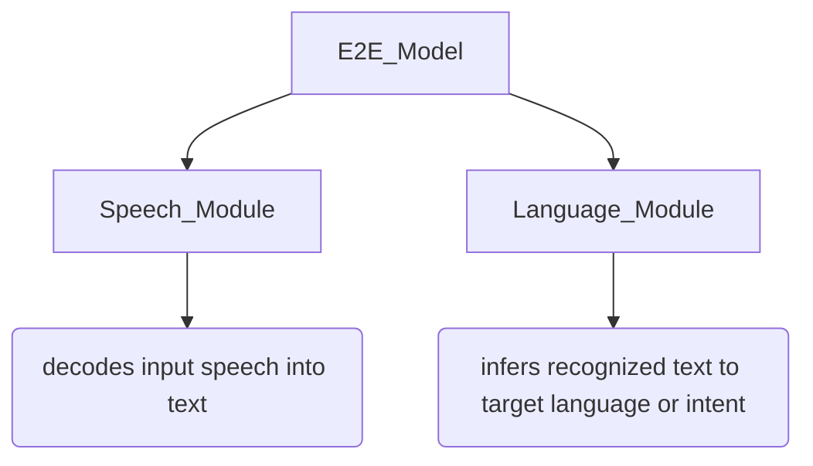

In the realm of speech & language in machine learning, we often come across spoken language tasks like Speech translation, summarization, understanding etc. In recent years, an end-to-end (E2E) modeling approach has been widely applied to such tasks, where a single model is trained using E2E optimizations with task-oriented metrics. Conventional approaches employing separate speech and language models have faced several challenges such as scarcity of training data, high GPU computation, and effect of modality gap between speech & language (a significant one). To overcome these problems, a groundbreaking solution has emerged :fire: -

In this blog, we delve into solving & understanding the above mentioned problems faced in joint speech-language training, as well as explore the promising ideas presented by ComSL to revolutionize the field.

> First of all, why do these challenges emerge and how do they post a big problem? 

A conventional E2E model pipeline design generally consists of 2 modules :

These 2 modules are trained using their own respective criteria, which may not be optimal for each other. Therefore, the *cascaded* process may propagate errors that might have occured in a current module to the one following it. Also, since other information like prosodic features are contained in the speech, it becomes difficult to quantize them using language symbols, however they can be beneficial for spoken language tasks.

> So that's how the modality gap between the modules is a challenge. What about the other ones? 

Although unified speech language pretraining based on Transformer architecture has largely boosted E2E modeling for spoken language tasks. In such models, pretraining is conducted jointly on unlabeled speech, unlabeled text, paired speech-to-text and paired text-to-text in multiple languages using both supervised and self-supervised learning. The unified representation from both modalities are simultaneously learned via shared model parameters or auxiliary modality matching losses in pretraining stage. But, as pretrained speech-only and language-only models are becoming increasing powerful, to achieve a comparable performance with such a cascaded module system, unified speech-language pretraining must leverage same or larger scale of data used in only models, which makes training very challenging, because such large amount of required data is not easy to get :(

> Lack of GPU resources and time is always a problem, you know, we realized this when doing ASR assignments :)

### ComSL enters the chat 

With an innovative blend of transfer learning and cross-modality learning, ComSL streamlines the joint training of speech and language through a multi-task learning framework -
- It fully leverages existing pretrained models, no need for pretraining with large data from scratch, directly fine-tune it for downstream tasks, hence data efficient 
- Conventional approaches use contrastive learning among modalities, which require external or internal aligners to force-align speech & text at token/word level. But ComSL's cross-modality learning with speech-text mapping/matching on either representations is only based on concatenation of paired speech & text. This simplifies implementation and allows it to be incorporated in fine-tuning stage 
- Includes comprehensive ablation study on bridging gap of speech & languages and comparisons with previous works 
- The model outperforms SOTA Google USM, OpenAI whisper ad cascaded non-E2E models by 0.8, 1.8, 1.0 average BLEU score improvements on CoVoST2 evaluation set respectively

## The ComSL Model
### Problem Formulation
As we have seen now, the goal of E2E Speech Translation (ST) is to directly translate speech from a source language ($L_1$) into text in a target language ($L_2$), without generating an intermediate ASR transcription. Formally, we have to find the most likely sequence $y = \{y_1, y_2, \ldots , y_N\}$ (eg. words or characters) of length $N$ in $L_2$ given acoustic features $s = \{s_1, s_2, \ldots , s_T\}$ (eg. Mel Filter Bank features) of length $T$ in $L_1$. A Speech Translation (ST) corpus $D^{ST} = \{(s, x, y)\}$ generally contains $x = \{x_1, x_2, \ldots , x_M\}$ (i.e. the transcription of speech in source language), in addition to $y$ and $s$. This allows to use Machine Translation (MT) and ASR as auxiliary tasks in a **Multi-Task** learning manner during optimization of E2E ST model, combinging the losses as - 
    
$$L = L_{ST} + L_{MT} + L_{ASR}$$ 

> What is this Multitasking now & Why? *(screwing up several things at once :))*

In machine learning, multi-task learning (MTL) is a powerful tool that allows different tasks to share common knowledge, boosting overall performance. However, in practice, it faces challenges. For instance, while automatic speech recognition (ASR) can enhance speech representations, the strict alignment required between speech and text can hinder tasks with significant differences in word order. Meanwhile, machine translation (MT) tasks can act as guides for speech-to-text tasks, as mapping text to text is generally easier than mapping speech to text. Yet, the mismatch between speech and text modalities may weaken this guidance's effectiveness. Thus, while MTL holds promise, navigating these complexities is key to maximizing its benefits!

### Model Architecture

Following the previous works by top-class respected researchers, the model is taken to be a composite model mainly composed of 3 components :
1. **Speech Transformer Blocks** : Encoder which acts as a powerful speech representation extractor, initialized with encoder parameters of [whisper model](https://github.com/openai/whisper) :bulb: which has strong performance on speech-to-text as well as translation tasks
2. **Adapter** : consists of 2 layers, each composed of a feed-forward module and a 1-D convolution layer with 2 stride, achieving 4 times down-sampling for speech encoder outputs in total. Also, the non-linearity of feed-forward module can speed up adaptation of speech representations to be fed into language Transformer blocks
3. **Language Transformer Blocks** : initialized with [mBART model](https://huggingface.co/docs/transformers/en/model_doc/mbart), composed of 12 encoder and 12 decoder layers with model dimension of 1024 on 16 heads. It is pretrained on monolingual data and fine-tuned on paired MT data and thus capable of many-to-many translation. All its parameters are used to enhance the translation capability of ComSL.

Note that, as we told before, that ComSL leverages the existing pre-trained models, all of these components are initialized by some pretrained model except the adapter

## Cross-modality learning (CML) :crown: 
CML is a key component of ComSL introduced in the paper. In the previous Loss equation, we can feed speech-only and text-only inputs into the model to learn ST, ASR and MT tasks. But we wanted to ==minimize the gap between speech and text modalities== and so, we introduce CML based on paired speech-text input. The approach used is such that it intrinsically learns cross-modality information during model optimization, which is different from other approaches which rely on external forced-alignment methods to determine word/unit boundaries.

CML involves the following steps -
1. **Speech-Text Concatenation** - For utilizing paired speech-text data, concatenate the speech embedding $e^s$ (from adapter) and text embeddings $e^x$ (from tokenizer) are concatenated and pass them as input to mBART encoder for further processing
2. **Masked Token Prediction (MTP)** - involves randomly masking text tokens in the concatenated input and training the model to predict these masked tokens. The model learns to fill in the missing tokens based on their corresponding speech embeddings, establishing a strong relation between speech and text modalities.
3. **Speech to Text Mapping (STM)** - In this task, the model learns to map the input speech to the target text by conditioning the encoder output hidden state on both the input speech and the masked ground-truth transcription. The goal is to generate accurate representations that align speech and text.
4. **Encoder Representation Matching (ERM)** - To align speech-only representations with the concatenated input, ComSL employs a loss function that encourages the speech-only representation to be closer to the concatenated representation. This loss is applied to the hidden states of the text encoder, bridging the gap between the modalities.
5. **Decoder Distribution Matching (DDM)** - DDM enhances the performance of the speech translation (ST) task by leveraging the output distribution of the machine translation (MT) task. By incorporating MT output into the ST loss, the model benefits from the better performance of MT and improves its translation capabilities.

These cross-modality learning tasks collectively contribute to the overall performance of ComSL by minimizing the gap between speech and text representations. By incorporating these techniques, ComSL achieves remarkable results in end-to-end speech-to-text translation tasks, surpassing state-of-the-art models in terms of accuracy and data efficiency.

> But, how is the main training done with all of these many things incorporated? 

## Training Strategies
ComSL employs several training strategies and follows a well-defined pipeline to optimize the performance and effectiveness of the model. Here is an overview of the training strategies and pipeline utilized in ComSL:
- **Fine-tuning Language Model** - Before the model composition, it is fine-tuned with all paired text training data by integrating the mBART-50 model. As we observed, mBART has a good extension capability so that it can achieve decent performance even on unseen languages by fine-tuning with limited data. On the other hand, since Whisper has been already trained with data in 100 languages, fine-tuning it has less impact on the final performance.
- **Multi-task Learning** - ComSL utilizes MTL to train not only ST task (main) but also auxiliary tasks (AST and MT). Multiple loss functions are used such as negative log likelihood loss (for ASR), sequence-to-sequence mapping loss (for ST), cross-entropy loss (for MT) and the final loss $L_{total}$ is takes as weighted sum of these losses - $$ L_{total} = w_{asr} * L_{ASR} + w_{st} * L_{ST} + w_{mt} * L_{MT} + w_{CML} * L_{CML} $$ Multi-task learning allows shared knowledge and information to be effectively utilized among different tasks, enhancing the overall performance.
- **Regularization on MT Output** - As the language transformer block (mBART-50) were fine-tuned with MT tasks, they can overfit in multi-learning for composite model. So, to prevent overfitting, introduce an additional language model $\theta'$ (fine-tuned mBART-50) and freeze  its parameters during training. Also, add a cross-entropy loss to minimize the difference of their output distributions. This operation is similar to that in ST task, i.e., *using a better task as a teacher to guide a relatively worse task*. This regularization technique ensures the generalization and stability of the MT task within ComSL.
- **Freezing Speech Encoder** - If you remember, the speech and language transformer blocks are initialized by well-trained speech-only and text-only models, while the adapter is randomly initialized. So, these three components should use different learning rates during the training. For this, *freeze* the speech encoder at the first few epochs. This retains powerful speech representations during the early stage of fine-tuning when the gradients are unstable. The language component has the regularization on the MT output that plays a similar role.

> So, that is how it is done, what was to be done. Let's see the outcome of all this hardwork - 

## Experiments & Results
### Datasets
1. **E2E ST Data** Experiments were conducted on the ==CoVoST2 dataset==, rich in multilingual speech translations. Our focus? The non-English to English translations (X-EN) using around 400 hours of English recordings and 900 hours from 21 other languages.
2. **Pseudo ST Data** To make up for data for low-resource language pairs in CoVoST2, we cleverly integrated unlabeled translations (translated the transcriptions into English) from Mozilla Common Voice dataset using the mBART model, effectively expanding the dataset by approximately 300 hours across 16 languages.

### Experimental Setup
Two versions of model, named **ComSL Medium** and **ComSL Large** are used in experiments. ComSL Medium uses a Whisper medium encoder with 24 layers of Transformer blocks with 1024 hidden dimensions and 16 heads. On the other hand, ComSL Large steps it up with a larger Whisper encoder using 32 layers of Transformer blocks, 1280 hidden dimensions, and 20 heads. Both versions are equipped with a two-layer convolution adapter and initialized with the mBART model, with parameters totaling 0.9 billion for ComSL Medium and 1.3 billion for ComSL Large.

Models underwent rigorous training on GPU clusters, trimmed audio recordings, and employed optimization techniques like deepspeed ZeRo and activation checkpointing. During inference, we unleashed beam search with a beam size of 5 and evaluated BLEU scores using sacreBLEU.

### Main Results
The main results are shown in Table1. We divide the 21 test languages into three groups: High-resource, Medium-resource, and Low-resource. With average BLEU scores in hand, we then compare and contrast the performance of ComSL Medium and Large against their predecessors, Whisper Medium and Large. With BLEU scores of 29.7 and 30.1, respectively, ==ComSL Medium and Large outshine Whisper Medium and Large==

The main factors contributing to this improvement are:
- Replacement of the Whisper decoder with mBART 
- The application of our training strategies and losses in training the combined Whisper and mBART models

Both ComSL Medium and ComSL Large (with a BLEU score of 31.5, which is 0.8 higher than USM with 0.7B fewer parameters) outperform USM when pseudo ST data is used. But there's still a performance dip attributed to ASR errors when compared to employing ground-truth transcription as inputs for MT.

### Analysis

#### Ablation Study on training tasks, losses and strategies

In a series of ablation studies, ComSL Medium's performance was analyzed. Initially trained only with the Speech-to-Text (ST) loss, it achieved a BLEU score of 26.48. Adding the Machine Translation (MT) task led to a marginal decrease to 26.31, indicating that directly applying MT task doesn't directly improve performance. Adding more tasks like  Distilled Dual Matching (DDM), Automatic Speech Recognition (ASR) and freezing speech encoder parameters early in training, MT regularization, cross modality learning (CML) loss and pseudo ST data improved the results significantly to a BLEU score of 30.77. 
#### Comparison across different Cross-Modality Learning (CML) methods

The baseline model is trained with all strategies and tasks except the methods of minimizing modality gap. It's performance is compared with our CML, previous MML, ConST and WACO methods. Our CML performs best with an average BLEU score of 29.69. MML is a close runner-up but it requires internal alignment at the tokens which makes the training process more expensive.

Similarity matrices of speech and text representations, give us a further insight into what happens after CML tasks. The model demonstrates strong text and speech representation alignment even without explicit modality gap minimization, likely benefiting from ASR task knowledge. Cross-Modal Learning (CML) enhances this alignment, creating unified representations even for non-speech tokens like punctuation and silence (illustrated by the green box in the figure). This precise encoding of speech information is a unique feature of CML.

### Conclusion
In summary, ComSL provides a transformative solution to the challenges in joint speech-language training, revolutionizing the way we approach spoken language tasks. The aim of bridging the gap between speech and text representations was achieved through cross-modality learning tasks, in addition to other auxiliary tasks like ASR and MT. The composite model outperformed the constituent speech model (Whisper) or cascaded speech and language models (Whisper+mBART). With its state-of-the-art performance, data efficiency, and innovative cross-modality learning, ComSL sets the stage for a new era of advancements in speech and language processing!

### References

- https://arxiv.org/pdf/2305.14838.pdf
- https://neurips.cc/virtual/2023/poster/72758